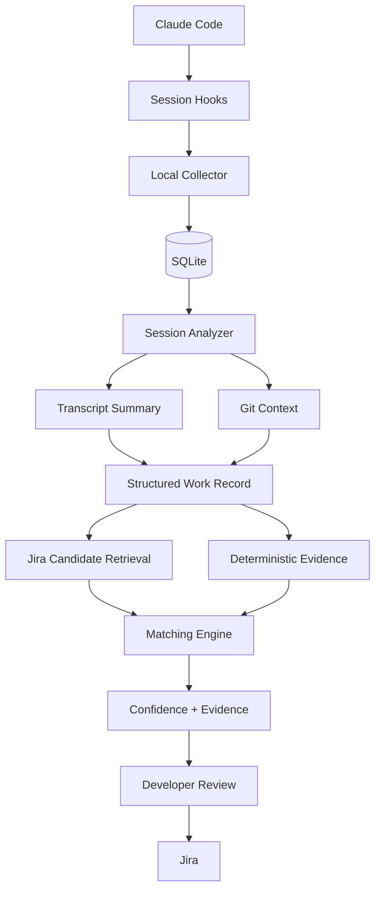

# WorkTrace

> **AI Work Reconciliation for Developers**

WorkTrace helps developers reconcile the work they actually performed in AI coding sessions with the work recorded in Jira.

The core idea:

> **At the end of the day, identify the Claude Code sessions you worked in, match them to the most likely Jira items, detect untracked work, and generate accurate Jira-ready updates.**

---

## Why WorkTrace?

AI coding agents are becoming part of everyday engineering work.

A developer may:

```text
open Claude Code
      ↓
investigate a problem
      ↓
change code
      ↓
run tests
      ↓
finish the task
```

and only later realize:

```text
There is no Jira for this work.
```

The result is often a retrospective ticket with very little useful context.

WorkTrace is designed to close the gap between:

```text
Work that actually happened
        vs.
Work Jira says happened
```

---

## What WorkTrace Does

WorkTrace treats AI coding sessions as a source of engineering work evidence.

```text
Claude Code sessions
        ↓
Discover today's work
        ↓
Summarize meaningful activity
        ↓
Enrich with Git context
        ↓
Find likely Jira items
        ↓
Recommend mappings
        ↓
Detect missing Jira coverage
        ↓
Developer confirms
        ↓
Update or create Jira
```

The goal is **reconciliation**, not simply transcript storage.

---

## Example

At the end of the day:

```text
TODAY'S WORK
────────────────────────────────────────────────────

✓ XML reader implementation
  DATA-1842 — Add XML source support
  Confidence: 96%
  Evidence: Jira key found in Git branch

✓ GDPR purge correction
  DATA-1933 — Update GDPR purge process
  Confidence: 87%

⚠ Glue 5 compatibility investigation
  No confirmed Jira found

  Suggested:
  Create "Validate ETL Framework on AWS Glue 5"

○ MCP research
  Suggested action: Ignore / Research
```

Instead of manually reconstructing the day, the developer mainly reviews and confirms WorkTrace's recommendations.

---

## Core Principles

### Evidence before inference

Prefer deterministic evidence such as:

- Jira key in Git branch
- Jira key in commit
- Jira key in pull request
- Jira key explicitly mentioned in the session

before using semantic or LLM-based matching.

---

### Human in the loop

WorkTrace recommends actions.

The developer remains authoritative.

```text
[ Confirm Jira ]
[ Choose another Jira ]
[ Create Jira ]
[ Create subtask ]
[ Split work ]
[ Ignore ]
```

---

### Local first

Claude transcripts may contain sensitive engineering information.

The default design keeps raw transcripts local and sends Jira only the minimum structured information required for traceability.

---

### Many-to-many mapping

WorkTrace does not assume:

```text
1 session = 1 Jira
```

It supports:

```text
multiple sessions → one Jira

one session → multiple Jira items
```

---

## MVP

The first version will **not** start with the full drag-and-drop UI.

The MVP focuses on proving session discovery and Jira matching quality.

### V0

```text
Claude Code
     ↓
Session hooks
     ↓
SQLite
     ↓
Transcript summarizer
     ↓
Git enrichment
     ↓
Jira candidate retrieval
     ↓
Matching engine
     ↓
jira-reconcile CLI
     ↓
User confirmation
```

Initial behavior will be read-only.

Example:

```text
$ jira-reconcile

3 engineering sessions found
2 Jira items matched
1 Jira item potentially missing
```

Jira write-back will be enabled only after matching quality is validated.

---

## High-Level Architecture



---

## Documentation

The detailed product and technical design is maintained in the `docs/` folder.

| Document | Description |
|---|---|
| [Problem Statement](docs/01-problem.md) | The workflow problem WorkTrace is designed to solve |
| [Solution](docs/02-solution.md) | Proposed end-to-end WorkTrace workflow |
| [Existing Landscape](docs/03-existing-landscape.md) | Existing Atlassian, Claude, and adjacent product capabilities |
| [MVP](docs/04-mvp.md) | V0 scope, flow, exclusions, and success criteria |
| [Architecture](docs/05-architecture.md) | Components and high-level architecture |
| [Matching Strategy](docs/06-matching-strategy.md) | Deterministic and semantic Jira matching approach |
| [Data Model](docs/07-data-model.md) | Core entities and many-to-many mapping model |
| [Privacy](docs/08-privacy.md) | Local-first data handling and transcript privacy |
| [Roadmap](docs/09-roadmap.md) | V0 through future multi-agent/team capabilities |
| [Research & References](docs/10-research-references.md) | Platforms and products considered during research |

---

## Current Status

**Status: Concept / MVP design**

Current focus:

```text
1. Claude session discovery
2. Structured work summarization
3. Git evidence extraction
4. Jira candidate retrieval
5. Matching quality
6. Read-only reconciliation CLI
```

---

## Planned Evolution

### V0 — CLI reconciliation

```text
Claude sessions → Jira recommendations
```

### V0.5 — Controlled Jira write-back

```text
Preview → Confirm → Jira comment / Jira creation
```

### V1 — Reconciliation UI

Two-panel experience:

```text
┌─────────────────────────────┬──────────────────────────────┐
│ JIRA                        │ CLAUDE SESSIONS              │
│                             │                              │
│ DATA-101                    │ Session A                    │
│ DATA-102                    │ Session B                    │
│ DATA-103                    │ Session C                    │
└─────────────────────────────┴──────────────────────────────┘
```

with suggested links, confidence scores, and drag-and-drop correction.

### V2 — Multi-agent

Potential support:

- Claude Code
- Codex
- Cursor
- GitHub Copilot agents
- Gemini CLI
- other coding agents

### V3 — Multiple systems of record

Potential integrations:

- Jira
- Linear
- Azure DevOps
- GitHub Issues

---

## Product Vision

Today:

```text
Developer works
      ↓
Developer forgets Jira
      ↓
Jira is reconstructed later
      ↓
Context is lost
```

With WorkTrace:

```text
Developer works normally
      ↓
AI sessions become work evidence
      ↓
WorkTrace reconciles evidence with Jira
      ↓
Developer confirms exceptions
      ↓
Jira accurately reflects actual work
```

---

## Positioning

WorkTrace is not intended to be only a:

```text
Claude → Jira connector
```

The broader concept is:

> **AI Work Reconciliation**

As AI coding agents become a normal development surface, WorkTrace aims to make sure the official system of record reflects the engineering work that actually happened.

---

## Repository

GitHub: https://github.com/gurditsingh/worktrace

---

## License

No open-source license has been selected yet.
