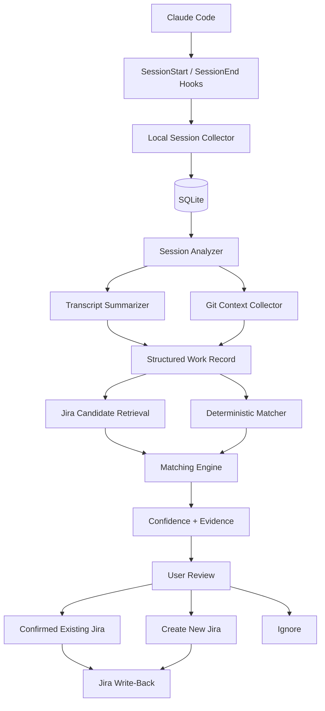

# Architecture

## V0 Architecture

The first WorkTrace architecture should remain local-first and modular.



---

## Logical Modules

A possible future code layout:

```text
worktrace/
├── collector/
│   ├── claude_hooks
│   └── session_registry
│
├── analyzer/
│   ├── transcript_reader
│   ├── work_classifier
│   └── summarizer
│
├── git/
│   ├── repository_context
│   ├── branch_parser
│   └── commit_parser
│
├── jira/
│   ├── client
│   ├── candidate_retriever
│   └── writer
│
├── matching/
│   ├── deterministic_matcher
│   ├── semantic_matcher
│   └── confidence
│
├── reconcile/
│   ├── workflow
│   └── cli
│
└── storage/
    ├── models
    └── sqlite
```

This is a logical design, not a requirement for the first commit.

---

# Component Responsibilities

## Session Collector

Responsibilities:

- receive Claude lifecycle hook events
- record session identity
- capture when the session was used
- associate working directory
- avoid duplicate session-day records
- track resumed sessions

It should not perform expensive transcript analysis inside the hook.

Hooks should remain fast.

---

## Local Storage

Initial choice:

```text
SQLite
```

Why:

- local-first
- zero infrastructure
- easy querying
- enough for single-developer MVP
- simple migration path later

Store raw transcript paths rather than copying transcript content unless necessary.

---

## Session Analyzer

Responsibilities:

- read transcript
- determine whether session represents meaningful work
- derive structured summary
- identify explicit Jira keys
- identify validation/test evidence
- classify session type

Possible work classifications:

```text
implementation
bug_fix
investigation
testing
refactor
documentation
research
non_work
```

---

## Git Context Collector

Responsibilities:

- identify repository
- read branch
- identify changed files
- inspect recent commits
- extract Jira keys
- optionally inspect PR metadata

Git-derived signals should remain separate from LLM-derived signals so confidence is explainable.

---

## Jira Candidate Retriever

Responsibilities:

- query a bounded Jira candidate set
- normalize work-item fields
- return only information required by matching

Example normalized record:

```json
{
  "key": "DATA-1842",
  "summary": "Add XML source support",
  "description": "...",
  "status": "In Progress",
  "assignee": "developer",
  "sprint": "Sprint 14"
}
```

---

## Matching Engine

Responsibilities:

- combine deterministic and semantic evidence
- produce ranked candidates
- calculate confidence
- explain why a match was proposed

Example:

```json
{
  "jira_key": "DATA-1842",
  "confidence": 0.96,
  "evidence": [
    {
      "type": "branch_key",
      "value": "DATA-1842",
      "weight": 1.0
    },
    {
      "type": "semantic_similarity",
      "score": 0.91
    }
  ]
}
```

---

## Reconciliation Workflow

Responsibilities:

- organize sessions for the selected day
- display mappings
- surface unmatched work
- capture user decisions
- persist final mappings
- hand confirmed actions to Jira writer

---

## Jira Writer

Write capabilities should be enabled gradually.

### Phase 1

```text
Generate proposed Jira comment only
```

### Phase 2

```text
Add Jira comment after confirmation
```

### Phase 3

```text
Create Jira / subtask
```

### Phase 4

Potentially:

```text
Update fields
Transition status
Attach richer evidence
```

---

# Architectural Principle — Evidence Before Inference

Prefer:

```text
branch contains DATA-1842
```

over:

```text
LLM believes DATA-1842 sounds related
```

The ideal pipeline is:

```text
deterministic evidence
        ↓
bounded candidate search
        ↓
semantic ranking if required
        ↓
human confirmation
```

---

# Architectural Principle — Local First

The local machine already has:

- Claude transcripts
- repository state
- branch information
- commits
- changed files

The MVP should process this locally wherever practical and send only minimal derived information to external systems.

See [Privacy](08-privacy.md).
